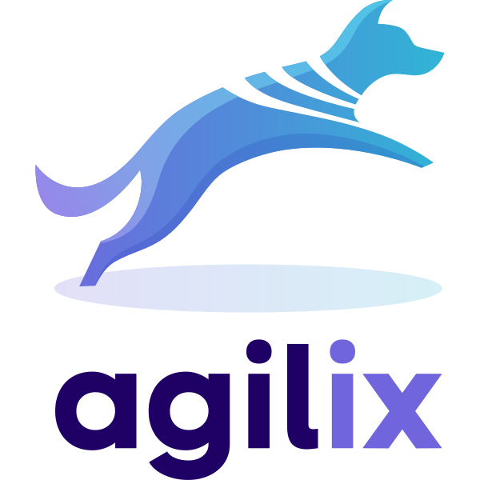

# Hey, I’m Renata 

Software Quality & Systems Analyst

## What I’m working on

   <strong>
    <a href="https://agilix.dog/competitions">
      
      Agilix
    </a>
  </strong> — a platform for managing dog sport competitions across Poland. Organizers create events, participants register their dogs, and everyone follows live scoring in real time. I focus on verifying the integrity of the 17-package monorepo, ensuring that real-time scoring systems meet strict quality and logic standards. I bridge the gap between technical requirements and system reliability.

The platform supports **Agility, Hoopers, Nosework, and Obedience** serving thousands of competitors.

### Tech

## What I bring to a project

- Comprehensive Quality Assurance: Over 6 years of expertise in designing and executing end-to-end testing strategies for web and API layers.  
- Deep System Analysis: Leveraging hands-on familiarity with TypeScript, React, and Node.js to perform effective root-cause analysis and identify edge cases before they reach production.  
- Reliability & Predictability: A strong commitment to delivering reliable software through meticulous manual testing and stable automation suites using Playwright and Cypress.  
- Holistic Process Overlook: Experience in strengthening testing processes across different methodologies (Agile) to achieve a measurable reduction in production issues.  
